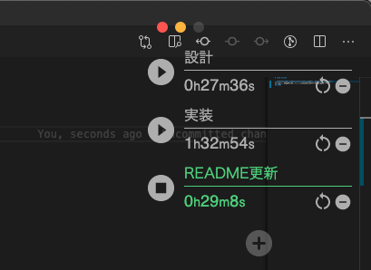

<h1 align="center">
   
  
   
  Time Recorder
   
</h1>

https://user-images.githubusercontent.com/77062779/213846662-b112cdce-dfa1-4687-9ac1-f8f928ec161b.MOV

# Time Recorder

複数のタイマーをオーバーレイで表示することができるアプリです。
タスクの実績工数や、ゆで卵の殻向きにどれだけ時間が掛かったかを計測するのに便利です。

## DEMO

- 再生ボタンを押すとタイマーがスタートします
- input 入力欄にタスク名を入れることができます
- +ボタンからタイマーを追加することができます
- タイマー稼働中は文字が緑色にハイライトされます
- 丸い矢印アイコンでタイマーをリセットすることができます

## Requirement
